Method 1 - Build locally
========================

Install Git and Python
----------------------

Git is the software used to maintain version control for lots of projects.    Usually it is for source control for development products, it works equally well for maintaining configuration changes.   While it can be used for binary as well as text data, Git's power is shown through best when working with text based documents.   Commit changes and version differences can be seen very clearly in these cases.   We need it for VS Code to be able to save changes to the git repos.

We'll also install python.   We don't strictly need it since we are using python under docker to build the html and pdf package but it's nice to have python installed because VS Code and some of the extensions require python to run.

This part of the document describes the installation process for these two pieces of software on windows.

Download Git
------------

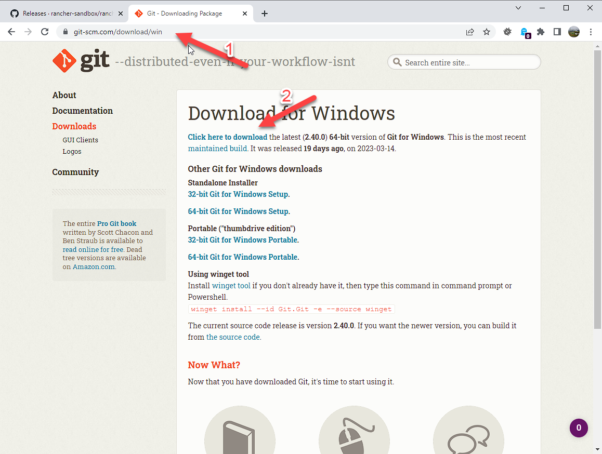

#. Navigate to https://git-scm.com/download/win
#. Click on the 'Click here to download' link to get the latest version of git for windows.

Continue Installation
---------------------

Most options are default.

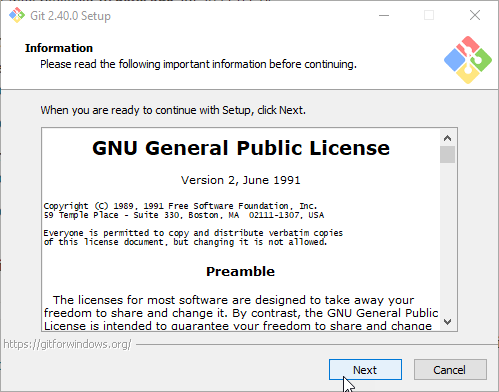

Next

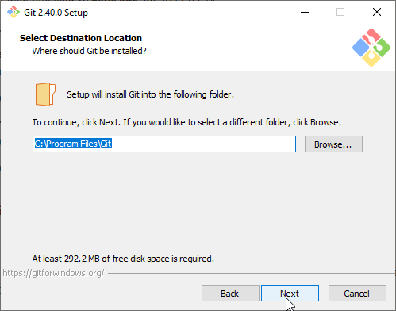

Next

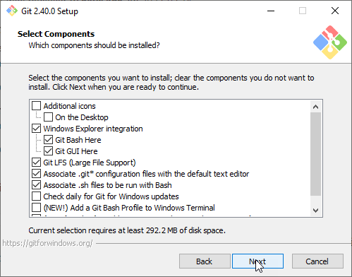

Next

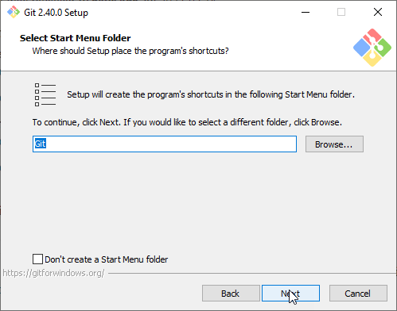

Next

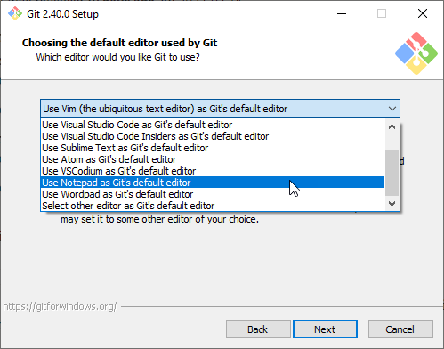

Select Notepad for git's default editor.   (It is hardly used).

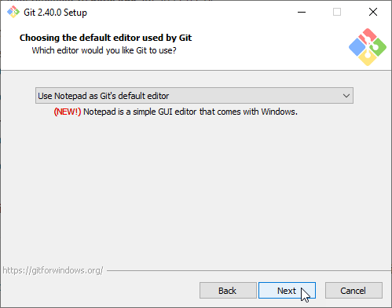

Next

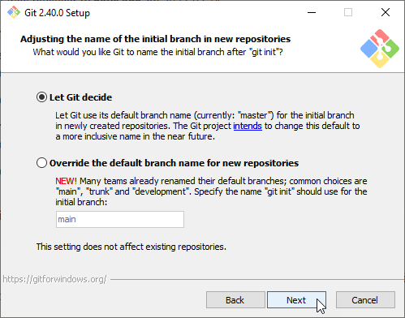

Next

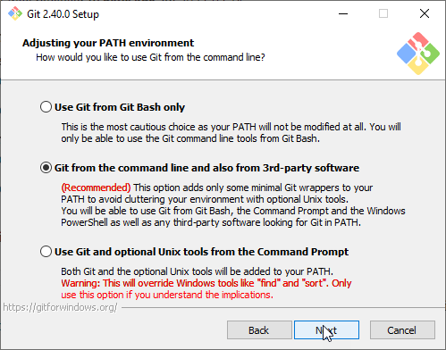

Next

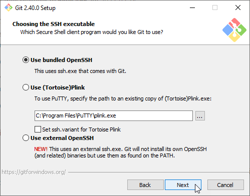

Next

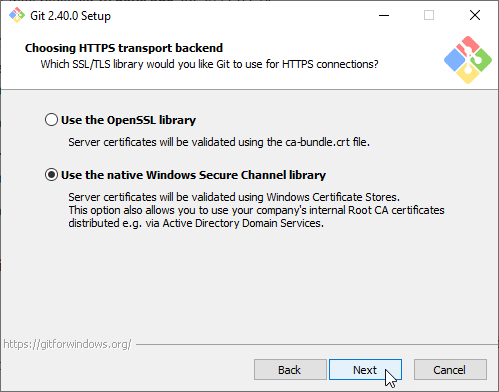

Next

.. image:: images/25.png

Next

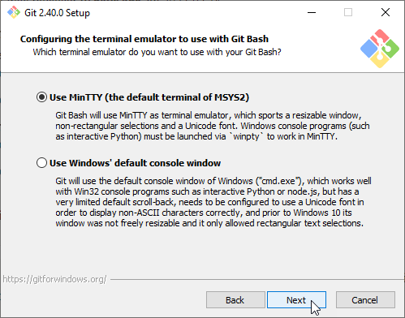

Next

.. image:: images/27.png

Next

.. image:: images/28.png

Next

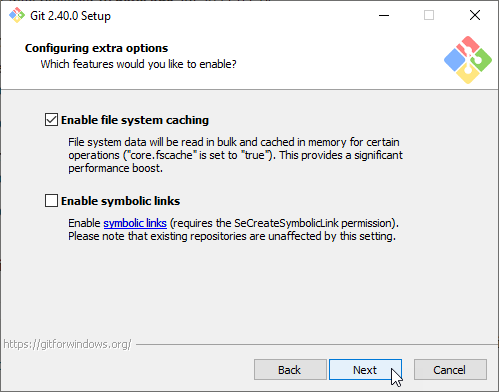

Next

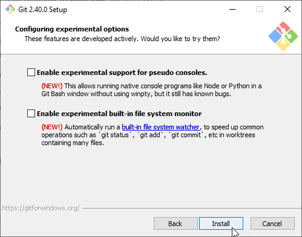

Next

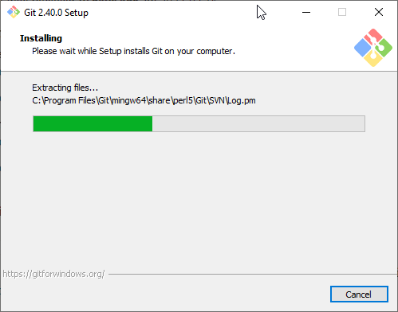

*Wait* for installation to finish

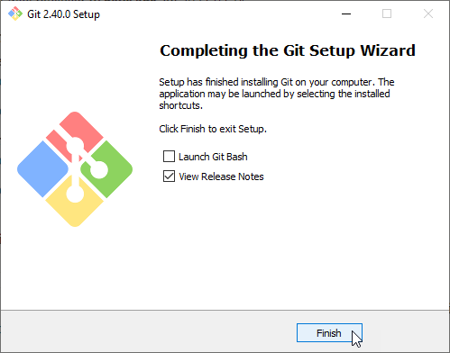

Click Finish

Setup Git user
--------------

.. image:: images/47-SetUpGit.png
    :scale: 70%

Type 'git' into the windows search bar and run Git CMD.

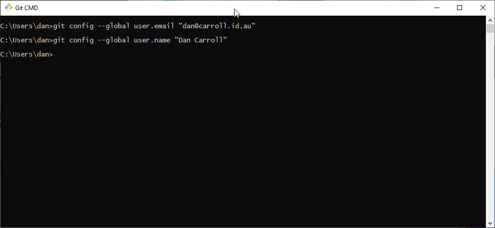

Execute the commands:

.. code-block:: console

   git config --global user.email "<Email Address>"
   git config --global user.name "<Full Name>"

Download Github CLI 
-------------------

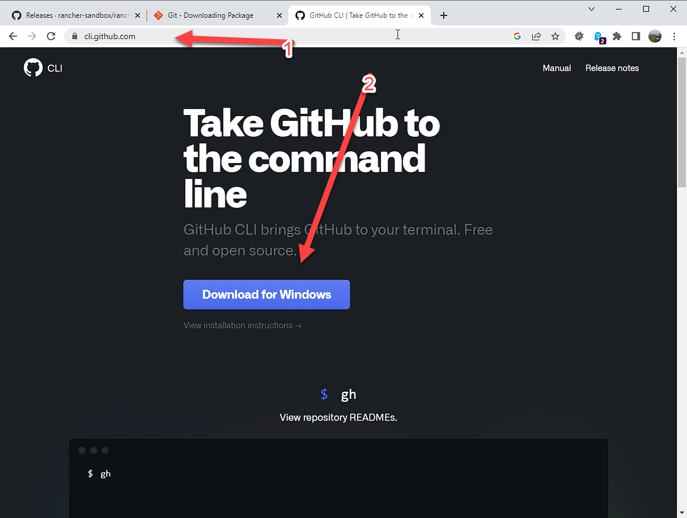

Github CLI are some CLI tools to help git authenticate seemlessly to GitHub.

#. Navigate to https://cli.github.com/ 
#. Click on "Download for Windows" to get the latest windows package.

Continue Installation
---------------------

Most options are default.

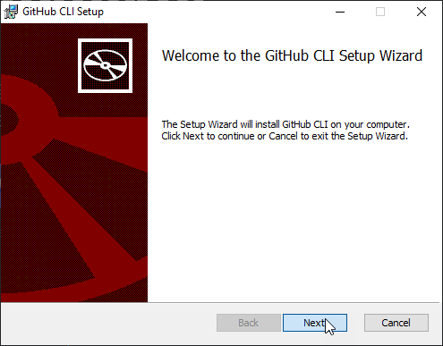

Next

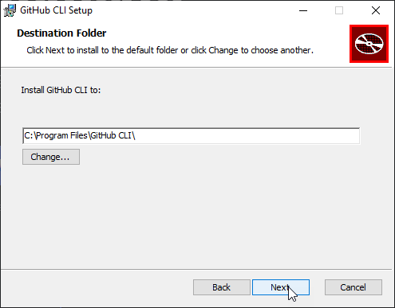

Next

.. image:: images/52.png

Install (You will probably have to confirm changes)

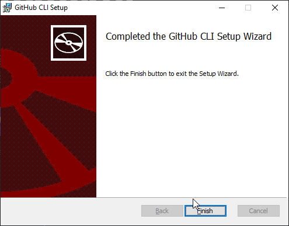

Finish

Download Python
---------------

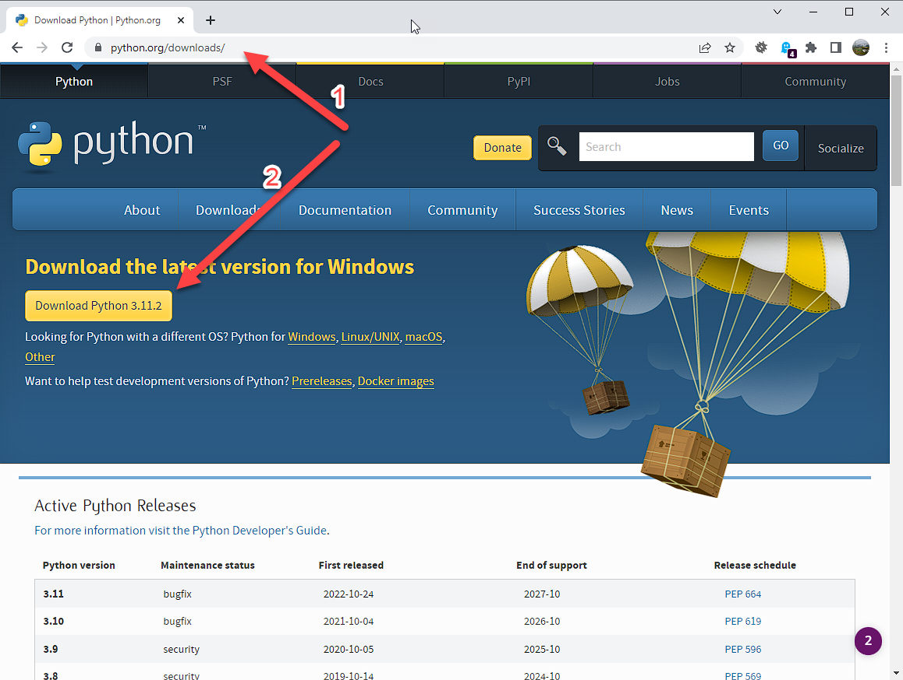

#. Navigate to https://python.org/download
#. Click on the 'Download Python XXX' link to get the latest version of python for windows.

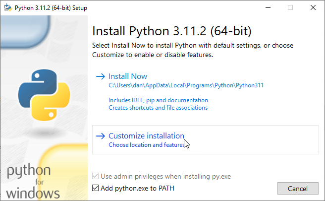

Make sure to select: "Add python.exe to PATH" and click "Customize installation".

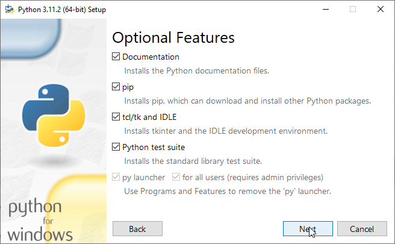

Make sue all 'Optional Features' are checked and click "Next".

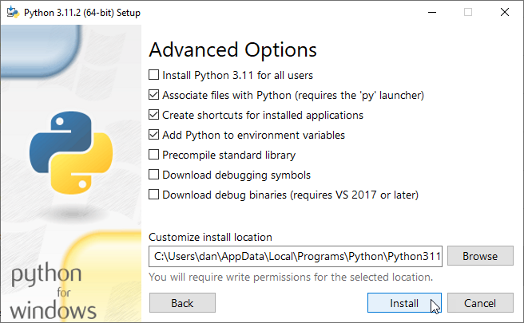

Make sure "Associate Files", "Create shortcuts" and "Add Python to environment variables" are all checked and click "Install".

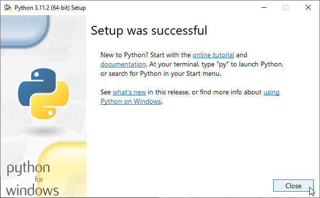

When the installation is complete, click Close.

