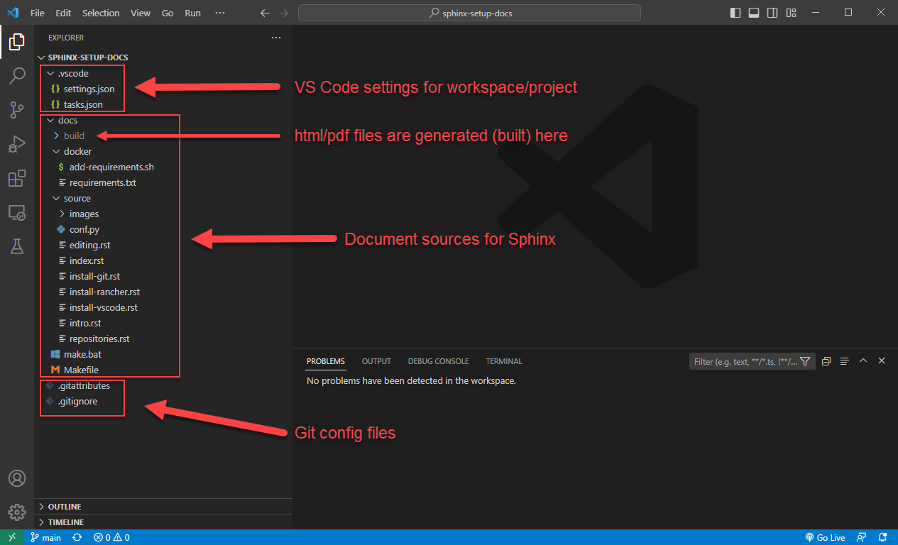
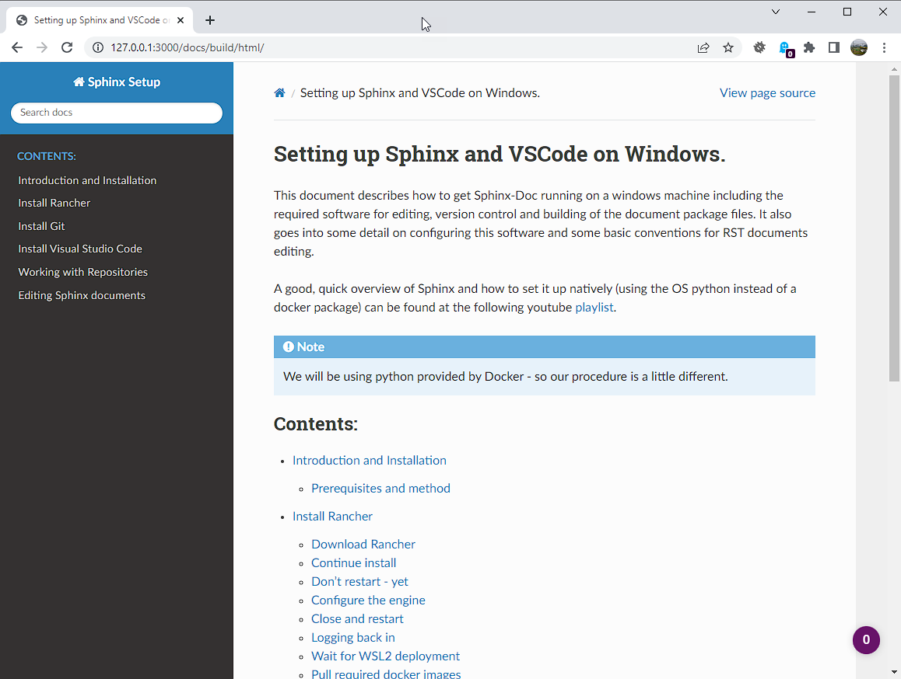

Editing Sphinx documents
========================

By this stage you should have the following:

* A working git installation.
* Rancher and Docker engine so you can run the Sphinx python code.
* Visual Studio installed with a few useful plugins.

So lets build a basic document, single page with a standard table of contents.   And then we'll build it into html with the locally installed python and sphinx.

Create a new working folder
---------------------------

Working folders are a little like projects.   You can think of the folder as a new project directory for your documentation.

Open up VS Code.   You should be at the welcome screen.   You can click on the "Open Folder" link, or go via the menu to the :menuselection:`File --> Open Folder` selection.  

.. image:: images/79-VSCode-NewFolder.png

Navigate to a directory where you would like to store your documentation 'projects' and click on New Folder.   I have chosen Documents/VS Code/ and created a new folder called `sphinx-demo`

.. image:: images/81.png

.. image:: images/82.png

Click on the newly created folder and click "Select Folder".

You will be asked to confirm if you trust the authors of this folder.   Since we are going to be the authors, you can click Yes.

.. image:: images/84.png

Set up git for this project
---------------------------

Next we need to intialise the repository for git.   Hit `Ctrl + Shift + G` or click on the "Source Control" button on the left hand side.

Then click on "Initialize Repository" and the git database will be created.    It is in a directory called .git but it is hidden from view.

Then click on "Explorer" button to get back to the main source navigation window.

Lets start by creating two files.   These are git files for controlling some of git's functionality.

.. image:: images/88.png

.. image:: images/89.png

Click on the new file icon in the Explorer and then type the name of the file: :file:`.gitattributes`

.. image:: images/90.png

Next, paste the following text into the file:

.. code-block::

    # Set the default behavior, in case people don't have core.autocrlf set.
    * text=auto

    # Explicitly declare text files you want to always be normalized and converted
    # to native line endings on checkout.
    #*.c text

    # Declare files that will always have CRLF line endings on checkout.
    #*.sln text eol=crlf

    # Declare files that will always have LF line endings on checkout.
    *.sh  text eol=lf

    # Denote all files that are truly binary and should not be modified.
    *.png binary
    *.jpg binary

This file just makes sure that .sh files are kept as unix LF encoding and .png/.jpg files are always treated as binary.

Repeat the process for :file:`.gitignore` which will tell git which files to never consider part of the source code.

.. code-block::

    # VSCode Sphinx Ignore

    # For now lets jsut store the sources.
    /docs/build

    # Put local python envs here.   Only relevant when using local python.
    /.env*

:file:`/docs/build` is the location of our build docs packages and :file:`/.env*` is the place where we will store our python environments (no need to add these to the source code)

.. image:: images/91.png

Notice how there is now a small '2' on the source control icon?   This tells us that there are two files changed since the last 'commit'.  The fact that the filenames are green also tell us they are new files (yellow would indicate a changed file).   We will commit the changes later.

.. image:: images/92.png

Set up python for this project
------------------------------

Next we will create our python environment.    Open a new 'terminal' window by selecting :menuselection:`Terminal->New Terminal`.  You should now see a powershell window in the bottom right of VSCode.

Type the following command: `python -m venv .env`

You should notice that the .env folder appears in your explorer.   It should be greyed out since we told git to ignore anthing matching `/.env*`.

.. image:: images/94.png

Hopefully you will see the popup asking if you want to make it the default for the workspace folder.    Click 'Yes'.   Starting a new terminal from now on will execute the command to set the python virtual environment to .env.   This can be seen by a green "(.env)" at the start of the line in the terminal.

Install Sphinx
--------------

In a new terminal window, type the following to install Sphinx into our python environment.   To keep things neat and tidy, lets put our document stuff in a subdir called docs.   In the terminal window, execute the following commands:

.. code-block::

    mkdir docs
    cd docs
    pip install sphinx

.. image:: images/96.png

Pip will install the python package and it's dependencies directly into your virtual python environment (.env).
Now we can initialise a new sphinx document.

You can do that by issuing the command sphinx-quickstart in the same terminal window.

It will ask you a number of questions.   Here are my suggestions

======================================= ======================= ===================================
Setting                                 Suggested Value         Notes 
======================================= ======================= ===================================
Separate source and build directories   Yes                     It makes for a cleaner install.
Project name                            Sphinx Demo             This text will appear in your docs
Author Name(s)                          Your name               Can also be team name or dept.
Project releases                        1                       Whatever versioning you wish to use
Project language                        en                      Corporate default
======================================= ======================= ===================================

When the quickstart process is finished, it will create some files in the current directory (docs).
Namely:

=================================== ===========================================================================
Directory                           Function
=================================== ===========================================================================
docs/build                          The directory where our packages will be built.  It should be greyed out since we elected to ignore it in gitignore.
docs/source                         The directory containing the RST source files and python config file.
docs/make.bat and /docs/Makefile    These are scripts used for building the packages.
=================================== ===========================================================================

Edit our first document
----------------------- 

In the explorer window, navigate to docs/source/index.rst and click on it to open it in an editor tab.
As a quick example, lets add some RST text and generate the html pages.

Just above the "Indices and tables" heading, paste the following text...

.. code-block::

    .. note::

        This is note text. If note text runs over a line, make sure the lines wrap
        and are indented to the same level as the note tag. If formatting is
        incorrect, part of the note might not render in the HTML output.

        Notes can have more than one paragraph. Successive paragraphs must indent
        to the same level as the rest of the note.

    .. warning::

        Warnings are formatted in the same way as notes. In the same way, lines
        must be broken and indented under the warning tag.

    .. error::

        This is an error!

    We can also do math: Since Pythagoras, we know that :math:`a^2 + b^2 = c^2`.

    For lists, just place an asterisk at
    the start of a paragraph and indent properly.  The same goes for numbered
    lists; they can also be auto numbered using a ``#`` sign.

    * This is a bulleted list.
    * It has two items, the second
        item uses two lines.

    #. This is a numbered list.
    #. It has two items too.

    1. This is a different numbered list.
    2. It has two items too.

    Nested lists are possible, but be aware that they must be separated from the
    parent list items by blank lines.

    * this is
    * a list

        * with a nested list
        * and some subitems

    * and here the parent list continues

Save the file and lets build the HTML package.

In the terminal window, type the following commands.   (Make sure you are still in the docs directory)

.. code-block::

    .\make clean
    .\make html

The first command makes sure the old html files are removed, and then the second command builds it again.  If all went well, you should see under the docs/build directory, a new directory called 'html' (and another called doctrees - you can ignore that)

Navigate into the html dir, and right click on index.html and select "Show Preview".   

.. image:: images/99.png

A new pane will open with a browser showing your page.    I'm not a big fan of that pane, but you can just copy the URL and open it in a normal browser.

The page looks nice, but there's a few things we should change.   Firstly, remove the "Indices and tables" section at the bottom.   It does not really do much for us.     Secondly, lets install a nicer html theme (the 'read the docs' theme).

Open the conf.py file in the docs directory.   This file is used to define how sphinx itself is configured.

Change the html_theme setting from alabaster to "sphinx_rtd_theme".   And above that line, add another line to import the python module for the RTD theme.   It should look like this:

.. code-block::

    import sphinx_rtd_theme
    html_theme = 'sphinx_rtd_theme'

But before we can build that, we have to install the sphinx_rtd_theme module into our python environment.    So in a terminal window, type the following.

.. code-block::

    pip install sphinx_rtd_theme

Now, run the `make clean ; make html` commands again to rebuild the docs.   If you go back to your browser and refresh you should see a big change.

WOW, that looks a whole lot nicer!

Tasks
-----

Next, to make things a little easier.   Lets make some tasks for building our html pages.

Hit Ctrl+Shift+P to bring up the VSCode command dialog.   It's a way for searching for a command when you don't know how to find it in the menu (or it does not have a key binding).   Type 'tasks', choose "Tasks: Configure Task" and select "Create tasks.json from template".  Choose 'Others' as the task template.

It will open an editor tab with a blank tasks.json file in it.   It looks like this:

.. code-block:: json

    {
        // See https://go.microsoft.com/fwlink/?LinkId=733558
        // for the documentation about the tasks.json format
        "version": "2.0.0",
        "tasks": [
            {
                "label": "echo",
                "type": "shell",
                "command": "echo Hello"
            }
        ]
    }

Change that for the following JSON code.    Basically, we're deleting the 'echo' task and adding two more, setting one of them as the default build task.

.. code-block:: json

    {
        // See https://go.microsoft.com/fwlink/?LinkId=733558
        // for the documentation about the tasks.json format
        "version": "2.0.0",
        "tasks": [
            {
                "label": "local-build-html",
                "type": "shell",
                "dependsOn": ["clean"],
                "command": "source ../.env/bin/activate; make html",
                "options": {
                    "cwd": "${workspaceFolder}/docs"
                },
                "windows": {
                    "command": "..\\.env\\Scripts\\Activate.ps1; .\\make.bat html",
                    "options": {
                        "cwd": "${workspaceFolder}/docs"
                    },
                },
                "group": {
                    "kind": "build",
                    "isDefault": true
                },
                "problemMatcher": []
            },
            {
                "label": "clean",
                "type": "shell",
                "command": "source ../.env/bin/activate; make clean",
                "options": {
                    "cwd": "${workspaceFolder}/docs"
                },
                "windows": {
                    "command": "..\\.env\\Scripts\\Activate.ps1; .\\make.bat clean",
                    "options": {
                        "cwd": "${workspaceFolder}/docs"
                    },
                },
                "group": {
                    "kind": "build",
                    "isDefault": false
                },
                "problemMatcher": []
            }
        ]
    }

In the code above you can see two tasks defined.   'local-build-html' and 'clean'.    These just do what we were doing manually with the ``make clean`` and ``make html`` commands.   The only difference is we have to tell VS Code where to work from  (cwd), and we have to set the python environment first (Activate.ps1).   There are also two commands defined in each task, one for windows (``..\\.env\\Scripts\\Activate.ps1; .\\make.bat <something>``). This overrides the other command, which is the unix corresponding unix command (``source ../.env/bin/activate; make <something>``).   

The 'group' section of the JSON data just tells VS Code that these are build tasks, and one of them is the default build task.  Finally, in the 'local-build-html' task, we have a 'dependsOn' setting.    This makes sure that the 'clean' task gets executed always before the 'local-build-html' task.

Once you have these saved to tasks.json you should be able to hit Ctrl+Shift+B and the html files will be re-build automatically.

Saving Changes - the git way
----------------------------

So saving the files happens normally of course but when we have git installed we can also save progressive versions.    Git is a little complicated but I'll go over the basics.   Your code is stored, not just in the working directory, but also in the git database under the .git directory.  For each change to one or more files you can save extra info.    Firstly, a small commit message (required) to mention what your changes are, but you can also add tags to a git commit so that it's clear what stage the full package is...    For instance, you might commit the current changes with "My first commit." and then add a tag that gives the whole package a version number.   Tags are optional so we'll ignore them for now.

Click on the 'Source Control' button and we will make our first commit.

In this image you can see there is a text box for the commit message.  And below that the list of changes.    Now, we need to tell git which changes we wish to commit to the git repo.   Clicking on the + on the changes row will let us add them all.

.. image:: images/102.png

Now we can see all of our changes are staged under the 'Staged Changes' branch and nothing is left in the 'Changes' branch.    Enter a commit message and click 'Commit'.   You should see all the changes disappear and the change counter on the left 'Source Control' button disappear as well.

When you navigate back to the Explorer, you will see in your source tree all of the green files are now white.

OLDER doc
---------

The docs are just sources.   There's no HTML or PDF yet.   So lets build that.

But first, I'll describe the directory structure of the Sphinx repo and a little info on the files and some settings..

What's in the repo?
-------------------

.. image:: images/73.png

Start up VS Code and choose 'Open Folder'.   Navigate to the github/sphinx-setup-docs folder and click "Select Folder".

This image shows the basic overview of the project folder.   If you expand the arrows it should look more or less the same.  Here is a list of what's in each folder:

/.vscode
    This folder stores the VS Code config files (in JSON format) for this workspace.   Workspace config generally overrides the global config.  The tasks.json file is interesting because it contains our build tasks for html and PDF.

/docs
    The docs folder is the document folder for sphinx.   It does not have to be this way but it's how I set it up for this project when I created the sphinx files.

/docs/build
    The generated files (html, pdf, epub etc) are all built into this directory.

/docs/docker
    To make this run smoothly, I've added 2 files to be included when we run the docker sphinx container.   ``add-requirements.sh`` simply downloads and adds the python modules in ``requirements.txt`` before building the doc files.   In this case we are only adding in the 'read-the-docs' html theme.

/docs/source
    The source files for our documentation are here.   Mainly rst files with the text and images we wish to include.  But also a configuration file that tells sphinx how to build the documentation (i.e. what themes to use and what doc generatio settings to use.)

/docs/make.bat and /docs/Makefile
    These are the commands that get run to build the documentation.

/.git*
    These are git config files.   In our case we tell git what to ignore (i.e. what not to save in the git repo), and also how to handle the CRLF settings for specific files.   We ignore the /build directory and any .env directories as well in case someone decides to create a python environment in the project.

Live Server
-----------

If you installed the "Live Preview" plugin, you can start a basic local html server to view your changes whenever you rebuild the documentation in html.   This is really handy for seeing your work progress.

.. image:: images/75.png

In the search bar (Ctrl-Shift-P) search for "> Live Preview" and click on "Live Preview: Start Server".   You might get a windows firewall warning to allow the traffic.

.. image:: images/76.png
    :scale: 30%

It should open a tab to http://127.0.0.1:3000/ but I find it easier opening that in a new web browser.
It will refresh the page with every change to the code.  If you navigate to http://127.0.0.1/docs/build/ you will see an empty webroot.

.. image:: images/77.png
    :scale: 30%

Build HTML and PDF documentation
--------------------------------

But if you now go back to VS Code and hit "Ctrl-Shift-B", the html pages will be built.    When it's done, there will be a 'doctrees' and a 'html' folder.     Click on the html folder and you should see the beautiful documentation.

Finally, if you hit "Ctrl-Shift-Alt-B", you should see a list of tasks.   They will do the following:

clean
    Clean up the build dir (remove everything).   Its not a bad idea to do this before a build.  Especially if you are building PDF files.

docker-build-html
    The same as Ctrl-Shit-B.   Just build the html using docker.

docker-build-pdf
    Build the PDF file and save it in docs/build/latex dir.   It should be the only PDF file there.

There are also some "local-build" tasks for building with the inbuilt python.   But this should really only be done if you set up a virtual environment for python.   And this is beyond the scope of this doc.   Docker is clean and the container is destroyed afterwards.