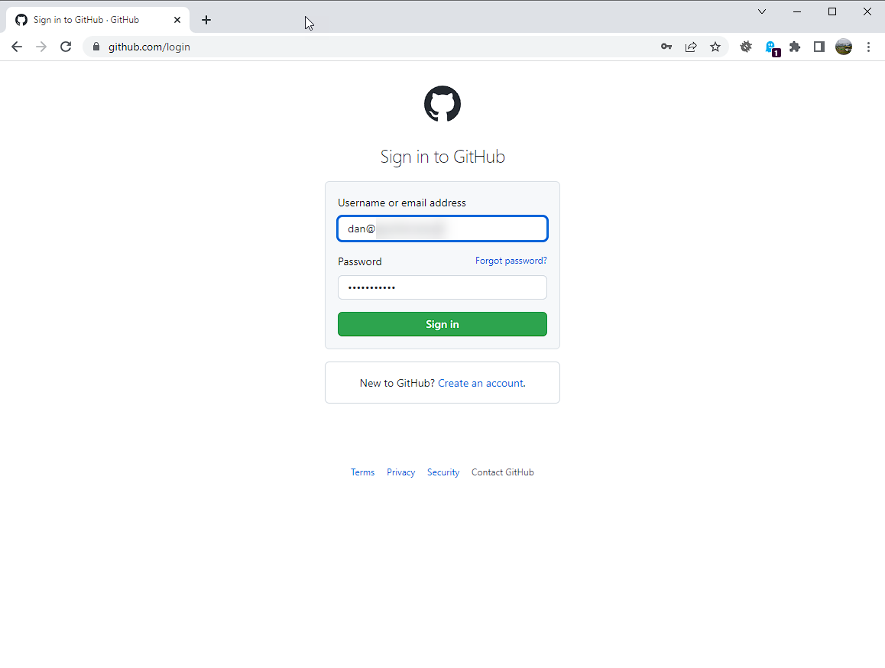
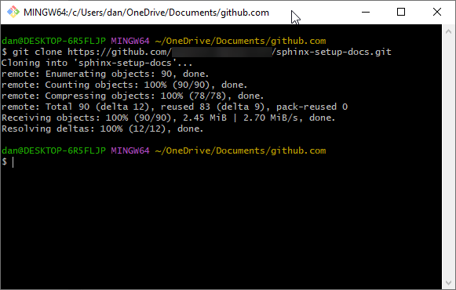

Working with Repositories
=====================================

The idea of storing your documentation in a repo stems from two advantages.   Firstly of course you can track your changes.   But secondly, and perhaps more importantly, you can store the sources for docs in one place, and when a commit is made to the main branch, it can trigger a CI process to build the doc packages, and distribute them to wherever they are used.

Sharing code with something like git can become complicated.  This document isn't meant to be about the ins and outs of SCM and git.  So for the sake of simplicity we'll assume you have the rights to push back to the repo you are cloning.   So in VS Code we'll save and commit to the local repo and push changes to a remote we have write access to.    For more information `Atlassian <https://www.atlassian.com/git/tutorials/comparing-workflows>`_ have a good document on git workflows.

.. There is a difference between forking and cloning.  Others have probably explained it better than I but basically, a clone is an identical copy while a fork is a linked copy of the repo.    If you wish to make changes to the code, you can simply clone the repository and commit changes to your local repo.   If the remote is a repository you have write access to you can later push your local change back.   However, if you wish to contribute changes to someone's public repo - which you only have read access to, you should first fork the original repo, then clone that one from github to your local machine.  In this way you can commit your changes locally, push them to your own github repo (a fork of the orginal), and then if you wish to contribute the changes you have made, request that the original repo owners 'pull' the changes from your forked repo in github to the original repo.

.. In a situation where you have a team working on a repo and a few developers all have access, lots of pull requests could get tedius.   the convention here is that the developer create a new branch for code changes, and then when they wish to merge these changes, they create a pull request (this time from the new branch to the main branch) and they can either have a colleague review and approve or perhaps approve their own pull request if the team is happy with that.

This part of the documentation will describe a few tasks.

* How to fork and clone a repository (we will use this one as an example) and set it up for visual studio.
* Build the documentation (html and pdf) from these sources.
* Make changes, and commit these back to our local repository.   And sync these to the remote.
* Create a pull request to send to the repo owner to accept changes.
* Create our own repo and start a fresh sphinx documentation project.

How to fork a repository
-------------------------

Since we're going to be operating on a repository we don't have access to, we first must fork the upstream repo into our own github account.
Then we'll clone that repo to our local machine and work on it.

If we owned the original repo or if we were part of the team that had write rights to the repo then of course we would not have to do the fork.   We would simply clone the repo locally and work away.

First log into git (login details are obscured)

In the git search bar, find the public repo for these docs (type DanCInOz/sphinx-setup-docs and hit enter).

Click on the result found.

On the top right, clock 'Fork' to create your own copy of the repo in your github account.

The default settings should be OK.   Click "Create Fork"

After the fork is created, you can clock on Code and copy the URL of *your* version of the git repository.

In your documents directory, create a folder called github.com (It's easy to put all cloned repos in this folder).   Navigate to that folder and right click on the explorer window and select "Git Bash Here".   This will open a command line for git so we can pull the code down from our github repo.

Type ``git clone`` and paste the URL you copied two steps above.   Hit enter.

If all is good you now have a copy of the github repo in your home documents folder. 

