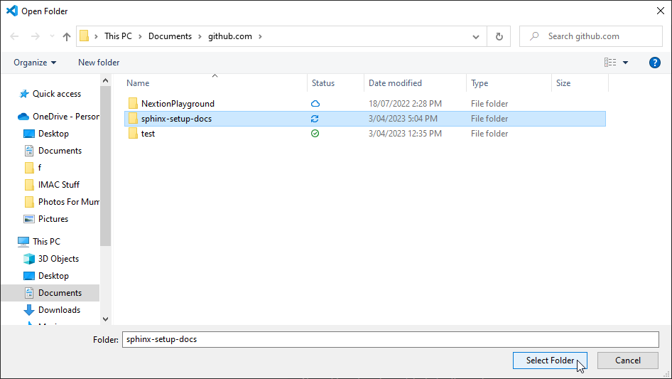
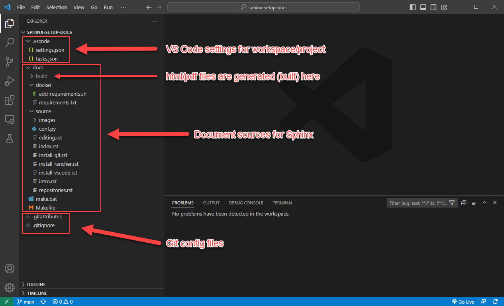
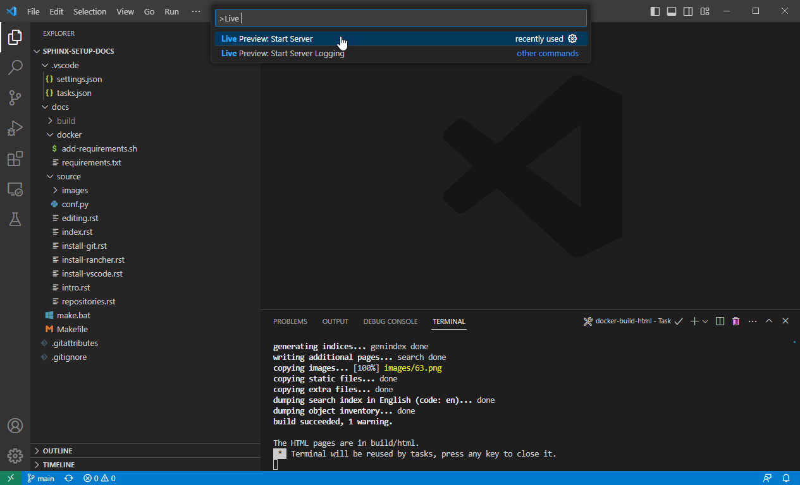
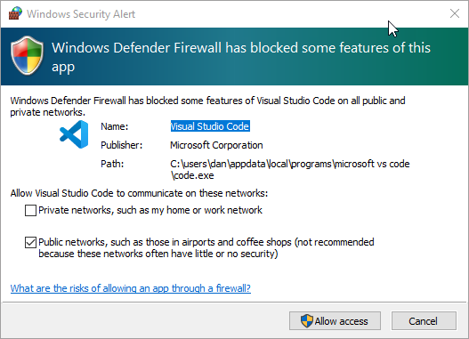
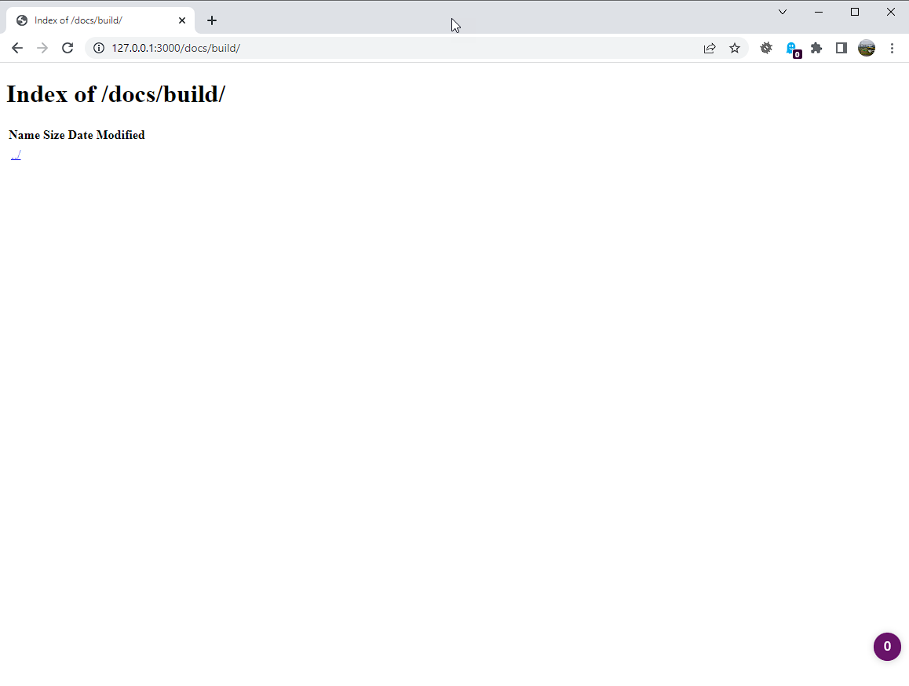
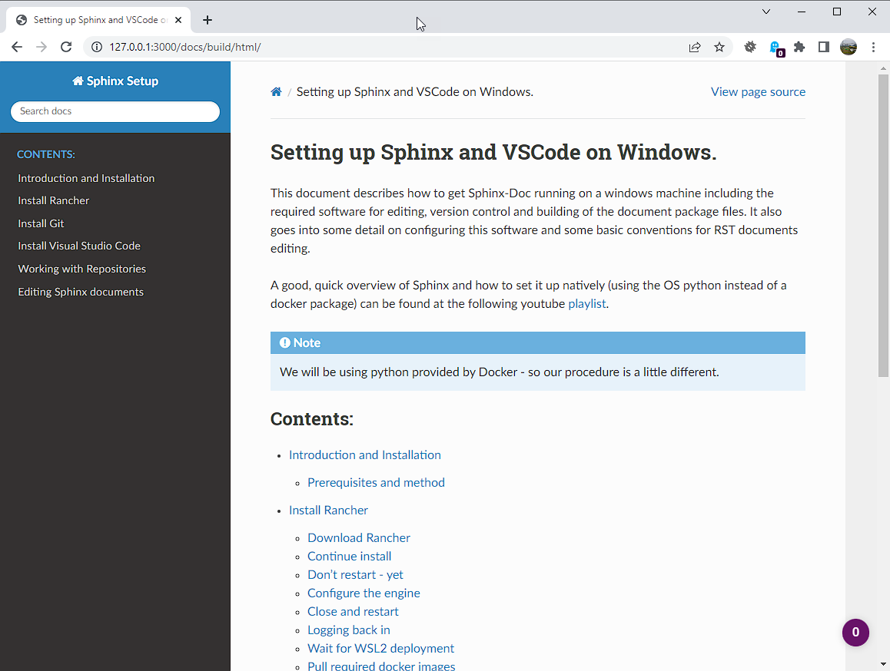

Editing Sphinx documents
========================

By this stage you should have the following:

* A working git installation.
* Rancher and Docker engine so you can run the Sphinx python code.
* Visual Studio installed with a few useful plugins.
* A forked and cloned copy of the repository for this documentation package.

The docs are just sources.   There's no HTML or PDF yet.   So lets build that.

But first, I'll describe the directory structure of the Sphinx repo and a little info on the files and some settings..

What's in the repo?
-------------------

Start up VS Code and choose 'Open Folder'.   Navigate to the github/sphinx-setup-docs folder and click "Select Folder".

This image shows the basic overview of the project folder.   If you expand the arrows it should look more or less the same.  Here is a list of what's in each folder:

/.vscode
    This folder stores the VS Code config files (in JSON format) for this workspace.   Workspace config generally overrides the global config.  The tasks.json file is interesting because it contains our build tasks for html and PDF.

/docs
    The docs folder is the document folder for sphinx.   It does not have to be this way but it's how I set it up for this project when I created the sphinx files.

/docs/build
    The generated files (html, pdf, epub etc) are all built into this directory.

/docs/docker
    To make this run smoothly, I've added 2 files to be included when we run the docker sphinx container.   ``add-requirements.sh`` simply downloads and adds the python modules in ``requirements.txt`` before building the doc files.   In this case we are only adding in the 'read-the-docs' html theme.

/docs/source
    The source files for our documentation are here.   Mainly rst files with the text and images we wish to include.  But also a configuration file that tells sphinx how to build the documentation (i.e. what themes to use and what doc generatio settings to use.)

/docs/make.bat and /docs/Makefile
    These are the commands that get run to build the documentation.

/.git*
    These are git config files.   In our case we tell git what to ignore (i.e. what not to save in the git repo), and also how to handle the CRLF settings for specific files.   We ignore the /build directory and any .env directories as well in case someone decides to create a python environment in the project.

Live Server
-----------

If you installed the "Live Preview" plugin, you can start a basic local html server to view your changes whenever you rebuild the documentation in html.   This is really handy for seeing your work progress.

In the search bar (Ctrl-Shift-P) search for "> Live Preview" and click on "Live Preview: Start Server".   You might get a windows firewall warning to allow the traffic.

It should open a tab to http://127.0.0.1:3000/ but I find it easier opening that in a new web browser.
It will refresh the page with every change to the code.  If you navigate to http://127.0.0.1/docs/build/ you will see an empty webroot.

Build HTML and PDF documentation
--------------------------------

But if you now go back to VS Code and hit "Ctrl-Shift-B", the html pages will be built.    When it's done, there will be a 'doctrees' and a 'html' folder.     Click on the html folder and you should see the beautiful documentation.

Finally, if you hit "Ctrl-Shift-Alt-B", you should see a list of tasks.   They will do the following:

clean
    Clean up the build dir (remove everything).   Its not a bad idea to do this before a build.  Especially if you are building PDF files.

docker-build-html
    The same as Ctrl-Shit-B.   Just build the html using docker.

docker-build-pdf
    Build the PDF file and save it in docs/build/latex dir.   It should be the only PDF file there.

There are also some "local-build" tasks for building with the inbuilt python.   But this should really only be done if you set up a virtual environment for python.   And this is beyond the scope of this doc.   Docker is clean and the container is destroyed afterwards.