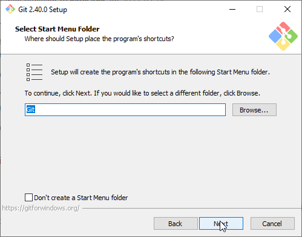
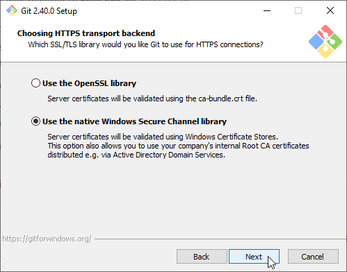
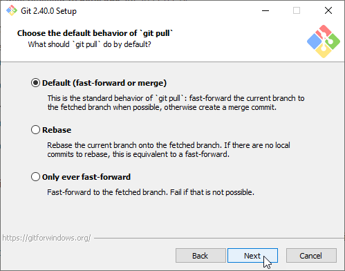
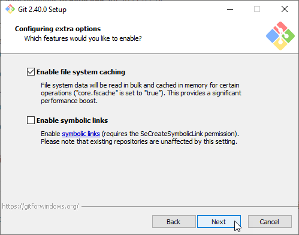
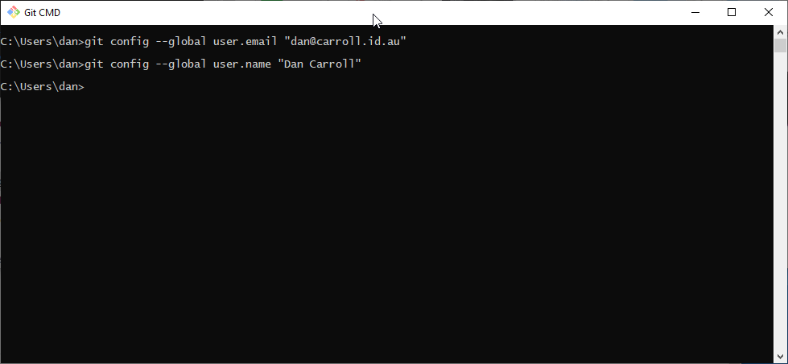
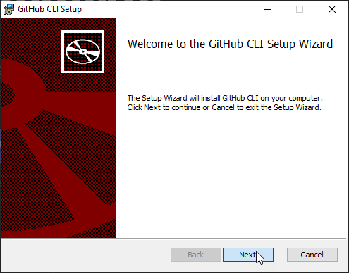

Install Git
===========

Git is the software used to maintain version control for lots of projects.    Usually it is for source control for development products, it works equally well for maintaining configuration changes.   While it can be used for binary as well as text data, Git's power is shown through best when working with text based documents.   Commit changes and version differences can be seen very clearly in these cases.   We need it for VSCode to be able to save changes to the git repos.

This part of the document describes the installation process for git on windows.

Download Git
------------

.. image:: images/14-Install-Git.png

#. Navigate to https://git-scm.com/download/win
#. Click on the 'Click here to download' link to get the latest version of git for windows.

Continue Installation
---------------------

Most options are default.

.. image:: images/15.png

Next

.. image:: images/16.png

Next

.. image:: images/17.png

Next

Next

.. image:: images/19.png

Select Notepad for git's default editor.   (It is hardly used).

.. image:: images/20.png

Next

.. image:: images/21.png

Next

.. image:: images/22.png

Next

.. image:: images/23.png

Next

Next

.. image:: images/25.png

Next

.. image:: images/26.png

Next

Next

.. image:: images/28.png

Next

Next

.. image:: images/30.png

Next

.. image:: images/31.png

*Wait* for installation to finish

.. image:: images/32.png

Click Finish

Setup Git user
--------------

.. image:: images/47-SetUpGit.png
    :scale: 70%

Type 'git' into the windows search bar and run Git CMD.

Execute the commands:

.. code-block:: console

   git config --global user.email "<Email Address>"
   git config --global user.name "<Full Name>"

Download Github CLI 
-------------------

.. image:: images/49-GithubCLI.png

Github CLI are some CLI tools to help git authenticate seemlessly to GitHub.

#. Navigate to https://cli.github.com/ 
#. Click on "Download for Windows" to get the latest windows package.

Continue Installation
---------------------

Most options are default.

Next

.. image:: images/51.png

Next

.. image:: images/52.png

Install (You will probably have to confirm changes)

.. image:: images/53.png

FinishNext

