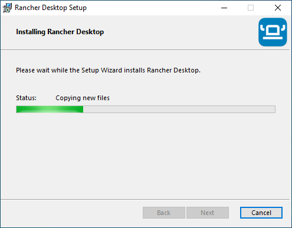
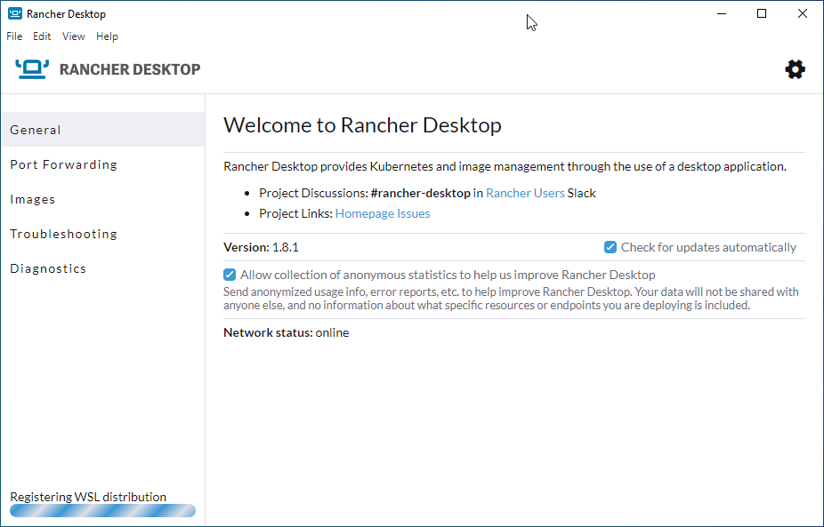

Install Rancher
===============

As mentioned earlier, Rancher is the software the controls the docker engine on your desktop.   We will run the sphinx images inside docker.

Download Rancher
----------------

#. In your favorite web browser navigate to this `page <https://github.com/rancher-sandbox/rancher-desktop/releases>`_: ``https://github.com/rancher-sandbox/rancher-desktop/releases``
#. Click on the "Windows" link to download the latest windows version.

Continue install
----------------

Click Next.

.. image:: images/03.png

Click Install.

*Wait*

.. image:: images/05.png

Click Finish.

Don't restart - yet
-------------------

.. image:: images/06.png

Click No.

.. warning:: 
   Clicking no here allows you to choose the initial setup for rancher (namely chosing the docker engine and not enabling Kubernetes).  It does produce an **error** however it is fixed after a reboot.

Configure the engine
--------------------

#. Disable (uncheck) Kibernetes.
#. Select "dockerd" as the container software.

Click Accept.

Close and restart
-----------------

.. image:: images/08.png

Click Close and restart.

.. note:: 
   After some time rancher will throw an error - this is because WLS2 and the docker image are not yet installed.   Reboot your PC.

Logging back in
---------------

After restart, upon log in WSL2 is installed.

Wait for WSL2 deployment
------------------------

Starting Rancher again shows WSL2 and the docker WSL image are being deployed.

When the messages in the bottom corner are gone, your rancher installation should be complete.

Pull required docker images
---------------------------

You can verify that docker is up by opening a command prompt and typing ``docker ps``.   It should just return the header row (starting with 'CONTAINER ID').  This tells us that the docker CLI tool can talk to the docker server.

Install the sphinx images.   Firstly, the base image.

.. code-block:: console

   docker pull sphinxdoc/sphinx

Install progress
----------------

.. image:: images/12.png

Next install the the PDF version.  The PDF version of sphinx is over 2Gb, so the download may take some time.

.. code-block:: console

   docker pull sphinxdoc/sphinx-latexpdf

Verify images in Rancher desktop
--------------------------------

Installed images are listed in Rancher.

In Rancher desktop you can click on the images tab to see installed images.

