Install Visual Studio Code
==========================

Visual Studio Code is a free editor of text files aimed at development.    It's enhanced by plugins to extend it's already full base features.

Download Visual Studio Code
---------------------------

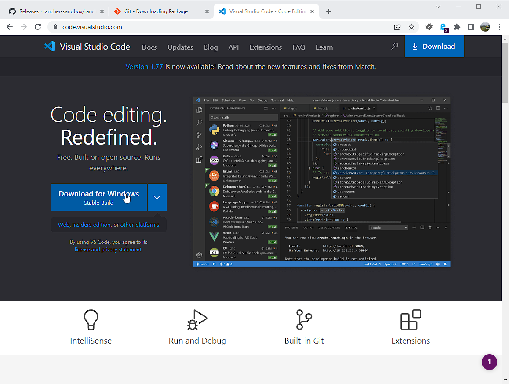

#. Navigate to https://code.visualstudio.com
#. Click on the 'Download for Windows' link to get the latest version of git for windows.

Continue installation
---------------------

Most options are default.

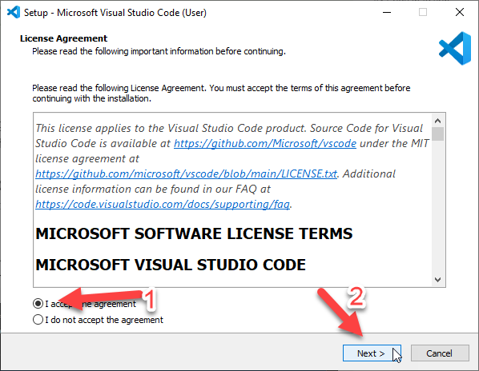

Next

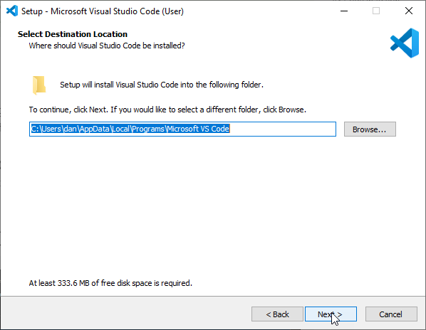

Next

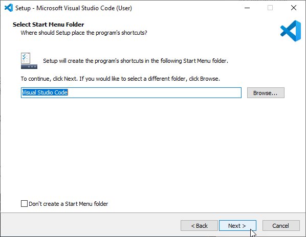

Next

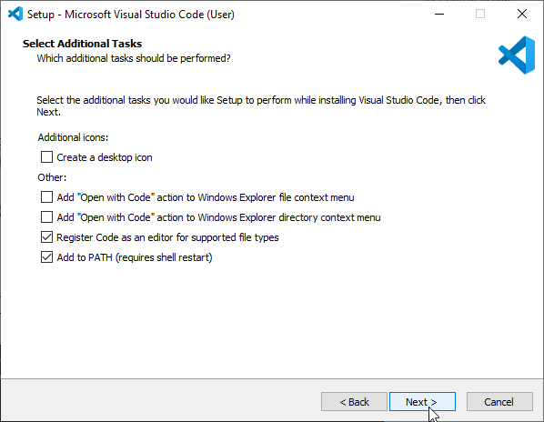

Next

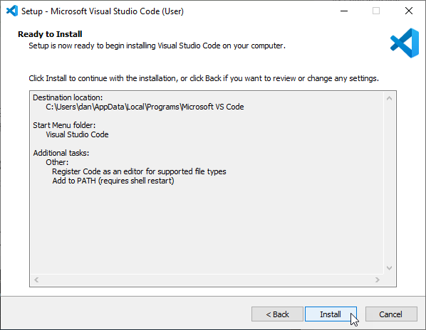

Next

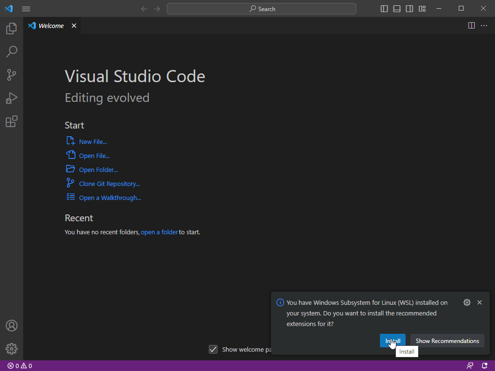

When the installation is complete, you will be asked to install the WSL extension.  While not strictly necessary, you can install it anyway.

Final Confguration of Visual Studio Code
----------------------------------------

VS Code is installed now.  But there's one or two things that you can do to make things easier on you.
These are largely optional but I find them useful.

Setup some key bindings
+++++++++++++++++++++++

Open VS Code and hit Ctrl-Shift-P to open the "Show Commands" search bar.   You can also access this by typing ">" in the standard search bar.  Type "Keyboard" and you will see some options.

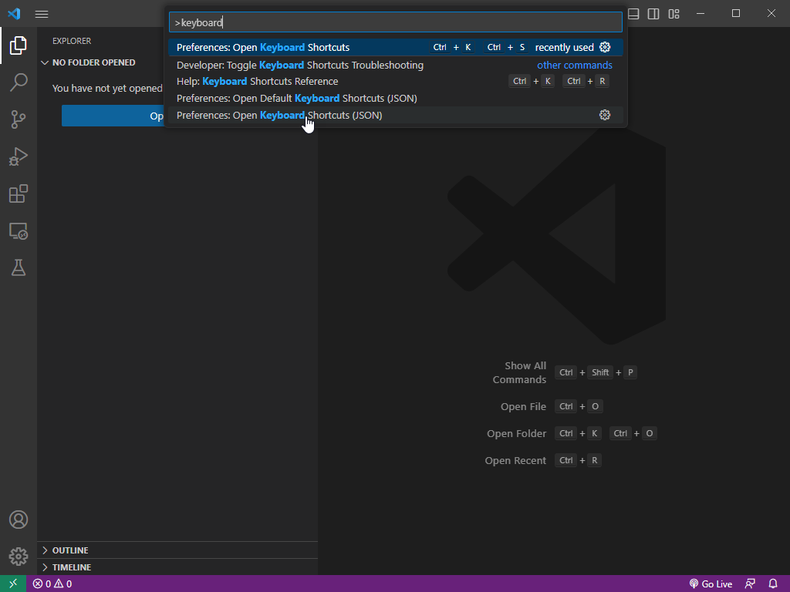

We're looking for the "Preferences: Open Keyboard Shortcuts" one.    Click on this (**Not the JSON version**, that is if you wish to edit the config file directly).

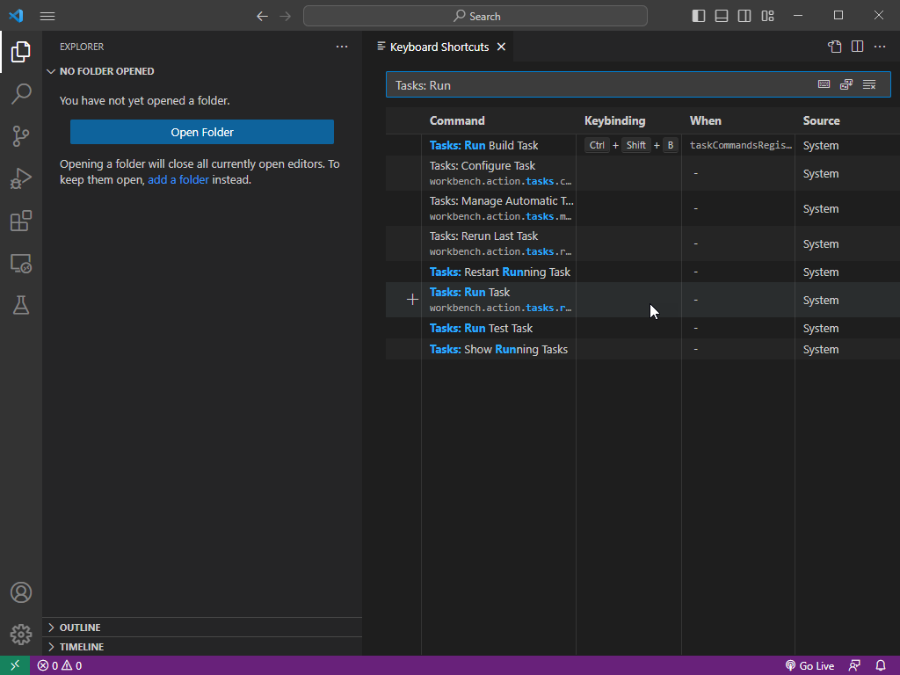

If you type in "Tasks: Run" then you will see a list of commands you can bind a shortcut key to.   Notice that "Ctrl + Shift + B" is already bound to the "Tasks: Run Build Task"?   We will use that to build our html documentation.

For now, lets bind a keyboard shortcut to "Tasks: Run" which will allow us to run any defined task.   Move your mouse over the "Tasks: Run" line and either click the + on the left or double click the line.   

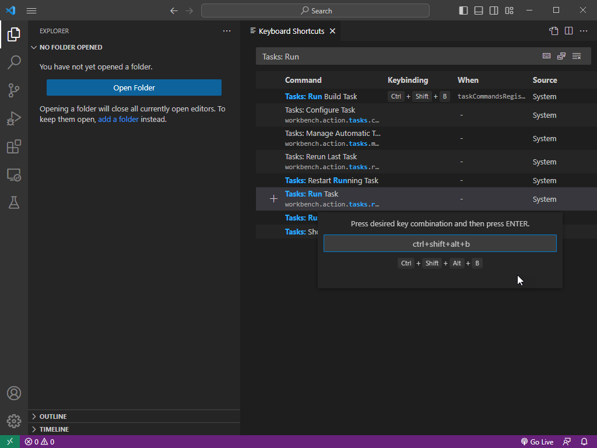

Hold down the keys "Ctrl, Shift, Alt and B".   If this keyboard shortcut were already used, it would give us a warning.   It is not so just hit Enter to confirm.

Install more  extensions
++++++++++++++++++++++++

We already installed the WSL extension again, but we can add a few more interesting ones.

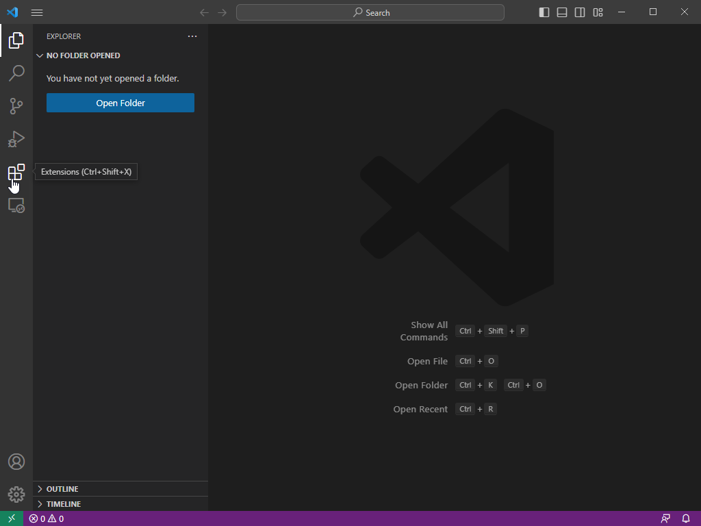

Click on the extensions button in the sidebar

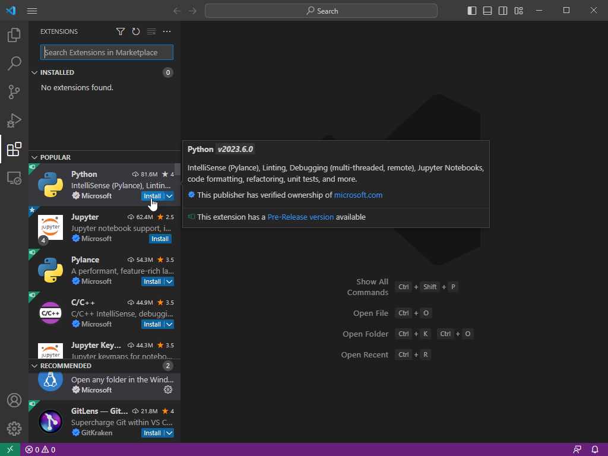

Search for 'Python' and install it.

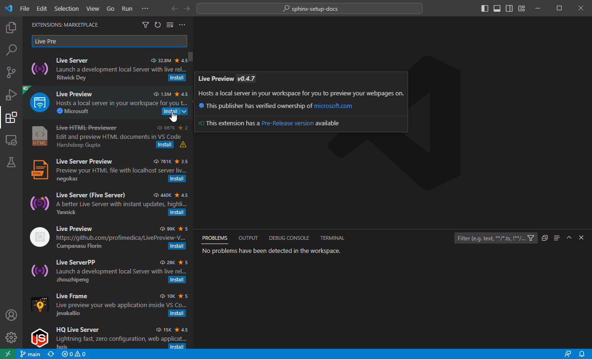

Search for 'Live Preview' and install it.

.. image:: images/43.png

Search for 'Restructured' and install both RestructuredTex...

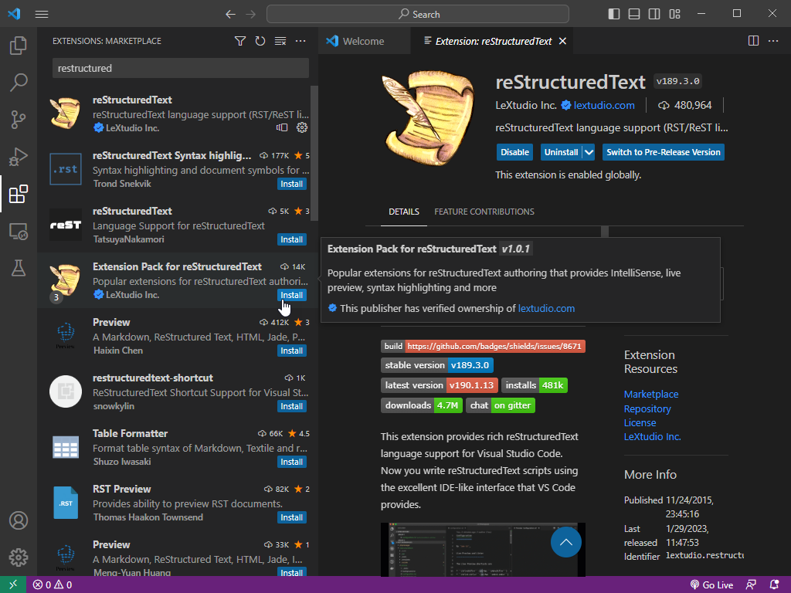

and the associated extensions pack (both by LeXtudio)

Visual studio code is now installed.  Next step, we will download the code to this documentation package and build it.
