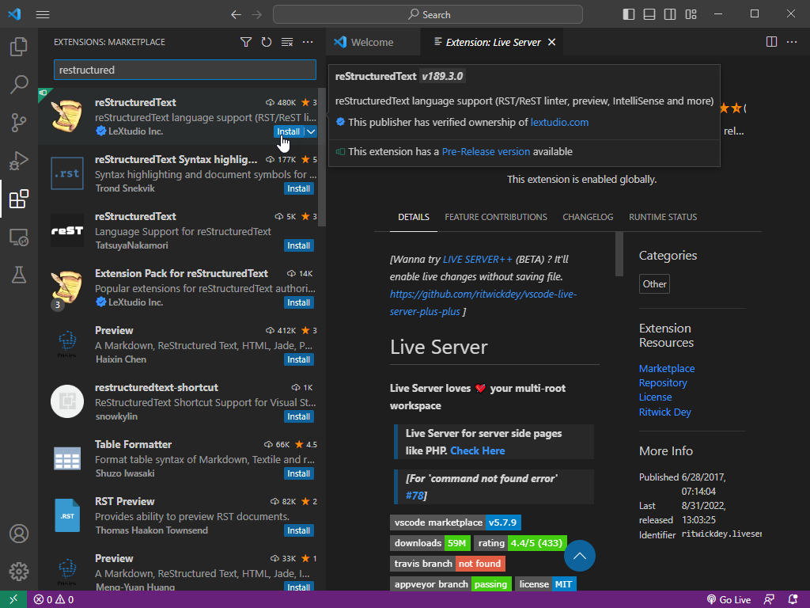

Install Visual Studio Code
==========================

Visual Studio Code is a free editor of text files aimed at development.    It's enhanced by plugins to extend it's already full base features.

Download Visual Studio Code
---------------------------

.. image:: images/33-Install-VSCode.png

#. Navigate to https://code.visualstudio.com
#. Click on the 'Download for Windows' link to get the latest version of git for windows.

Continue installation
---------------------

Most options are default.

.. image:: images/34.png

Next

.. image:: images/35.png

Next

.. image:: images/36.png

Next

Next

.. image:: images/38.png

Next

Install WSL (and other) plugins
-------------------------------

When the installation is complete, you will be asked to install the WSL extension.  While not strictly necessary, you can install it anyway.

Click on the extensions button in the sidebar

.. image:: images/41.png

Search for 'Python' and install it.

Search for 'Live Server' and install it.

Search for 'Restructured' and install both RestructuredTex...

and the associated extensions pack (both by LeXtudio)

